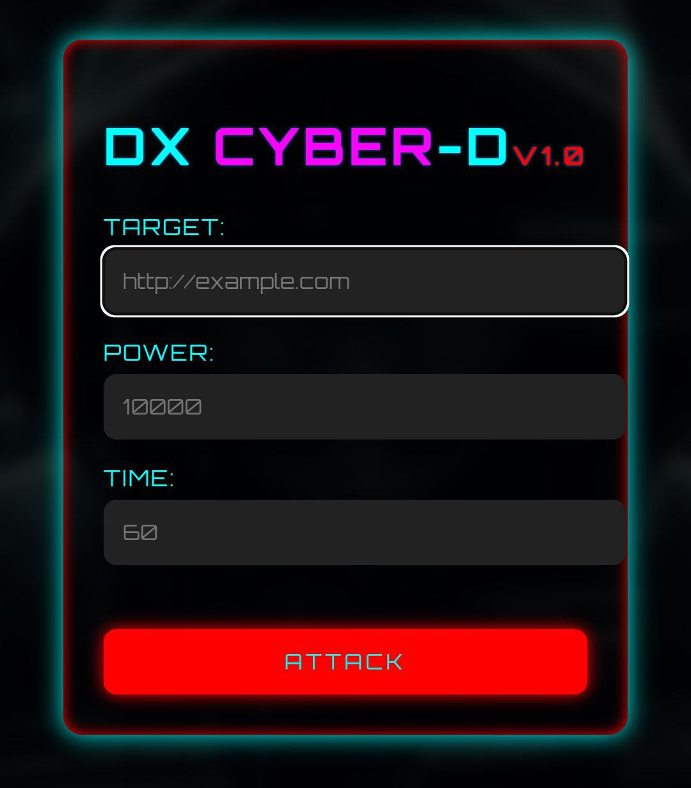

# DxCyberD - Dos tool

  
  

## Introduction

 Dx tool, also known as DxCyberD, is a dos attack tool made by the Cyber-D army. This tool is specifically designed for ethical hacking purposes to test the security of websites and computer systems. The Dx tool allows users to launch distributed denial of service (DDoS) attacks against targets of their choice, making it an important tool in the realm of cybersecurity.

## Disclaimer

**Usage of Dx for any malicious or unauthorized activities is strictly prohibited.** The developers of Dx and the Cyber-D team are not responsible for any damage, loss, or misuse of this tool. It is the responsibility of the user to comply with all applicable laws and regulations while using this Tool.

### How to Install

Linux commands.

* `sudo apt update`

* `sudo apt upgrade`

* `sudo apt install python3 git`

* `git clone https://github.com/kdo2064/DxCyberD`

* `cd DxCyberD`

Termux commands.

* `pkg update`

* `pkg upgrade`

* `pkg install python3 git -y`

* `git clone https://github.com/kdo2064/DxCyberD`

* `cd DxCyberD`

## Usage
After installing DxCyberD, you can use it to generate custom keyloggers. Here’s the basic command to run DxCyberD:`
* `python3 dx.py` for CLI mood
* `python3 dx-web.py` for GUI mood

## Legal Notice
DxCyberD is intended to be used for ethical and legal purposes, such as security testing and educational purposes. Any misuse or illegal use of this tool is not condoned.
The Cyber-D team and the developers of DxCyberD are not responsible for any illegal, unethical, or unauthorized activities performed by users of this tool.

## Visiter

